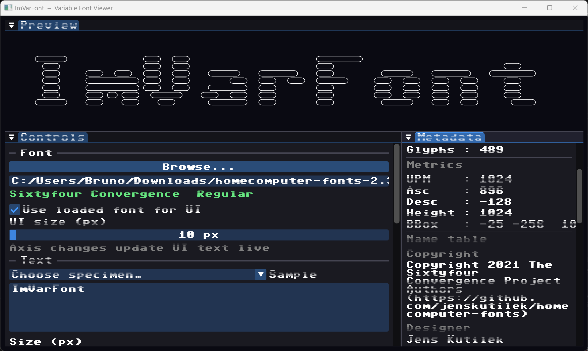

# ImVarFont

Variable-font rendering and axis controls for [Dear ImGui](https://github.com/ocornut/imgui).



Renders glyph outlines as stroked paths directly into an `ImDrawList` using
FreeType for outline extraction.  Variable-font design axes (weight, width,
custom axes like scanline or horizontal bleed) are automatically discovered
from the font file and exposed as ImGui slider widgets.

No texture atlas is required — outlines are tessellated on the fly via
`ImDrawList::PathBezierCubicCurveTo`.

---

## Features

- Works with any OTF / TTF file FreeType can open (static or variable)
- Axes discovered automatically from the font's `fvar` table
- `AxisSliders()` — one `SliderFloat` per axis with the axis name and 4-char tag
- `MetadataTable()` — family/style, variable flag, axis min/max/default table, live values
- Self-contained: two files (`imgui_var_font.h` + `imgui_var_font.cpp`)
- Follows Dear ImGui naming conventions (PascalCase members, snake_case parameters)

---

## Quick start

```cpp
#include "imgui_var_font.h"

// Load once
ImVarFont::Face* face = ImVarFont::LoadFace("fonts/MyFont.ttf");

// Each frame
if (ImVarFont::AxisSliders(face))
    ImVarFont::ApplyAxes(face);          // push new axis values to FreeType

float w = ImVarFont::CalcTextWidth(face, 96.f, "Hello");
ImVarFont::AddText(
    ImGui::GetWindowDrawList(), face,
    96.f,                                // em size in pixels
    ImVec2((width - w) * 0.5f, y),       // centred position
    IM_COL32_WHITE,
    "Hello",
    1.5f);                               // stroke thickness

// Cleanup
ImVarFont::FreeFace(face);
```

---

## API reference

```cpp
namespace ImVarFont {

struct Axis {
    ImU32  Tag;       // 4-byte OpenType tag
    char   Name[64];  // human-readable name from fvar
    float  Min, Max, Default;
    float  Value;     // current value – modify then call ApplyAxes()
};

// Lifecycle
Face* LoadFace(const char* path);
void  FreeFace(Face* face);

// Introspection
bool        IsLoaded(const Face*);
bool        IsVariable(const Face*);
const char* GetFamilyName(const Face*);
const char* GetStyleName(const Face*);
const char* GetFilePath(const Face*);

// Axis control
int   GetAxisCount(const Face*);
Axis* GetAxes(Face*);
void  SetAxisValue(Face*, int axis_idx, float v);
void  ResetAxes(Face*);          // resets all + calls ApplyAxes()
void  ApplyAxes(Face*);          // pushes Axis::Value to FreeType

// Widgets
bool AxisSliders(Face*, const char* str_id = "##imvarfont_axes");
void MetadataTable(const Face*);

// Rendering
float AddText(ImDrawList*, Face*, float em_px, ImVec2 pos,
              ImU32 col, const char* text, float thickness = 1.5f);
float CalcTextWidth(Face*, float em_px, const char* text);

// Tag helpers
ImU32 MakeTag(char a, char b, char c, char d);
void  TagToStr(ImU32 tag, char out[5]);

} // namespace ImVarFont
```

---

## Building the example

The example (`example/main.cpp`) uses GLFW + OpenGL 3.3.  Dear ImGui and GLFW
are fetched automatically by CMake; only FreeType needs to be on the system.

### Windows – MSYS2 / MinGW

```bash
pacman -S mingw-w64-ucrt-x86_64-freetype
cmake -B build -G "MinGW Makefiles" -DCMAKE_BUILD_TYPE=Release
cmake --build build
./example/ImVarFontExample.exe
```

### Windows – vcpkg + MSVC

```bash
vcpkg install freetype
cmake -B build -DCMAKE_TOOLCHAIN_FILE=C:/vcpkg/scripts/buildsystems/vcpkg.cmake
cmake --build build --config Release
```

### Linux

```bash
sudo apt install libfreetype-dev libgl1-mesa-dev
cmake -B build -DCMAKE_BUILD_TYPE=Release
cmake --build build
./example/ImVarFontExample
```

### macOS

```bash
brew install freetype
cmake -B build -DCMAKE_BUILD_TYPE=Release
cmake --build build
./example/ImVarFontExample
```

---

## Suggested test font

[Home Computer Fonts](https://github.com/13-Types/homecomputer-fonts) by
13 Types — variable fonts based on Commodore 64 and Amiga bitmap typefaces.
The scanline density and horizontal bleed axes make the sliders immediately
dramatic and are a natural fit for pen-plotter output.

---

## Rendering notes

- `AddText` treats `pos` as the **top-left corner** of the em square.
  The text baseline sits at `pos.y + ascender * scale`.
- Outlines use `FT_LOAD_NO_SCALE | FT_LOAD_NO_HINTING`; variation blending
  is applied by `ApplyAxes()` via `FT_Set_Var_Design_Coordinates()`.
- Quadratic (TrueType conic) Béziers are upgraded to cubics using
  `cp1 = P0 + ⅔(P1−P0)`, `cp2 = P2 + ⅔(P1−P2)` before being passed to
  `ImDrawList::PathBezierCubicCurveTo()`.
- Filled glyphs (requiring contour triangulation) are left as future work;
  stroke-only output is the right primitive for plotter workflows.

---

## License

MIT
